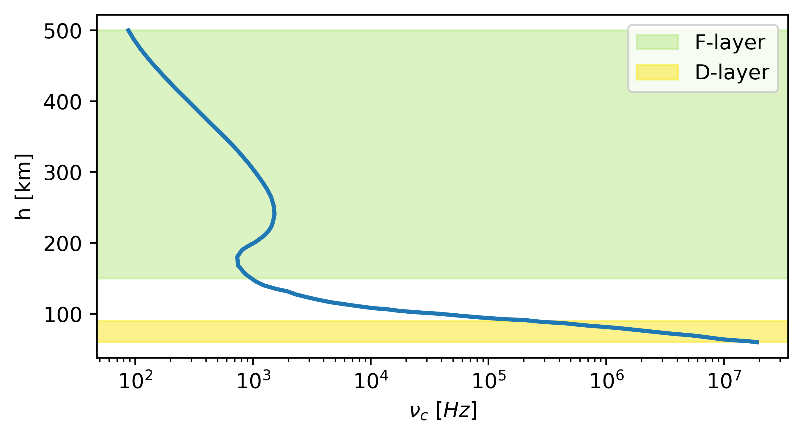
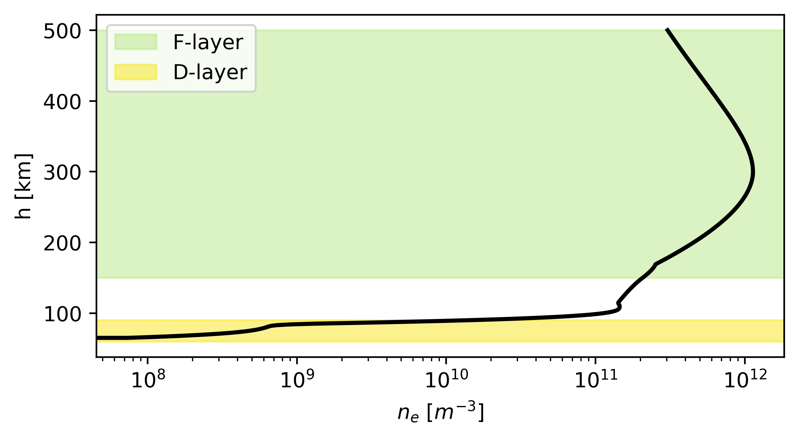
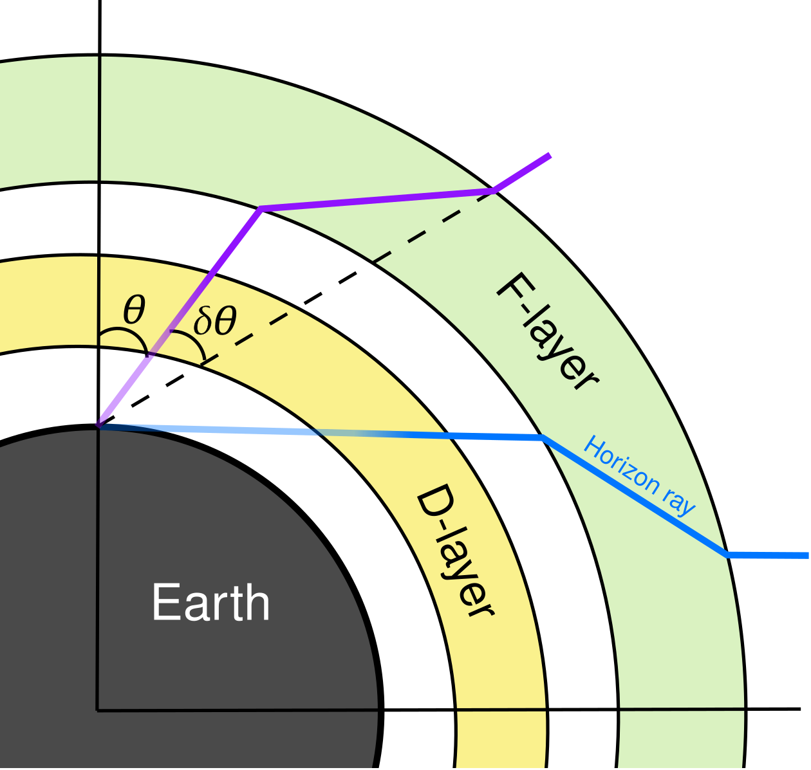
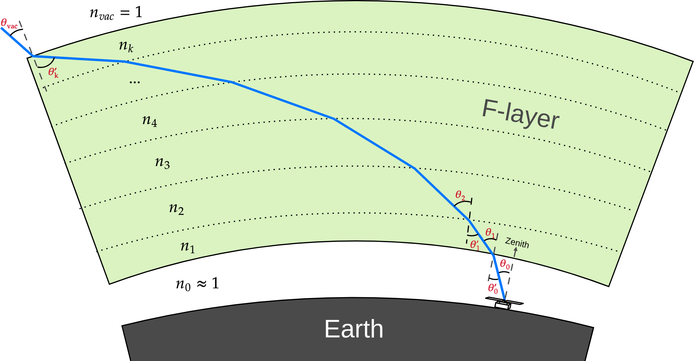
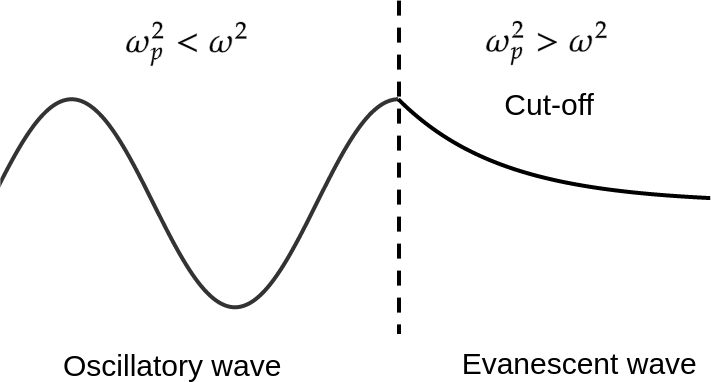
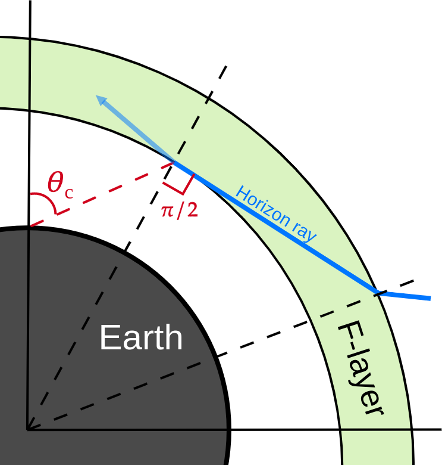

Overview
========

Introduction
------------
The ionosphere is a layer of magnetized plasma in the atmosphere of Earth, which extends approximately from 50 km to 600 km
above the surface. Wave propagation through the ionosphere can be described by plasma physics laws, in particular by
Appleton–Hartree equation :cite:p:`Shkarofsky1961`. This equation relates a complex refractive index :math:`\eta` with
properties of ionospheric plasma (magnetic fields, electron density, etc.). Since behaviour of magnetic fields in the
ionosphere is highly variable, it cannot be predicted without constant observations, which, in turn, makes it impossible
(for now) to create a general dynamic model of the ionosphere.
Fortunately, we can ignore the effect of the magnetic
fields for wide-field radio experiments :cite:p:`Vedantham2014`, which allows us to write the Appleton–Hartree equation
in simplified form:

.. math::

    \eta^2 = 1 - \frac{(\nu_p / \nu)^2}{1 - i(\nu_c / \nu)}

Here :math:`\nu` - frequency of observation, :math:`\nu_p` - plasma frequency, :math:`\nu_c` - electron collision
frequency. Now we go further and take into account the ionospheric electron density and electron collision frequency
profiles.

For simulations, we use the collision model from :cite:t:`AGGARWAL1979753`. Note that according to this model,
the collision frequency is much higher in the D-layer (60-90 km) than in the F-layer (150-500 km).

    Model of collision frequency in the ionosphere from :cite:t:`AGGARWAL1979753`.

For generating electron density altitude profiles we use the IRI-2016 model :cite:p:`Bilitza2017`. As
opposed to the collision frequency, the electron density is a few orders of magnitude higher in the F-layer than in the
D-layer.

    Typical electron density distribution in the ionosphere generated with IRI-2016.

Using the information provided above we can now make a couple of approximations. For the F-layer we set
:math:`\nu_c \rightarrow 0` and get

.. math::

    \eta_F \approx \sqrt{1 - (\nu_p / \nu)^2}

This approximation is a real number and describes ionospheric refraction.

In the D-layer we set
:math:`\nu_p(n_c) \rightarrow 0` and use Taylor expansion

.. math::

    \lim_{\nu_p\rightarrow0} \eta \approx 1 - \frac{1}{2}\frac{(\nu_p/\nu)^2}{1 + (\nu_c/\nu)^2} -
    \frac{i}{2}\frac{(\nu_p/\nu)^2}{1 + (\nu_c/\nu)^2} \frac{\nu_c}{\nu}

The real part of the result is negligible compared to refraction in the F-layer. Therefore we use only :math:`i\eta_D`
to model the ionospheric attenuation in the D-layer.

.. math::

    \eta_D = - \frac{1}{2} \frac{\nu_p^2 \nu_c}{\nu (\nu^2 + \nu_c^2)}

The illustration of the model in general is presented below. First, the cosmic signal is refracted in the F-layer. This
refraction is directed towards the zenith and allows us to register signals coming from below the visible horizon.
Then the signal is partially attenuated (and then re-emitted) in the D-layer.

    Two dominating ionosphere effects: attenuation in the D-layer and refraction in the F-layer.

Attenuation in D-layer
----------------------
The electric field of a wave travelling in a homogeneous ionospheric layer is given by

.. math::

    E(\Delta s) = E_0 \exp \left( -i\frac{2 \pi \nu}{c} \eta \, \Delta s \right)

Complex part of the refractive index :math:`(\eta = i \eta_D)` corresponds to the exponential decay. We define
the attenuation factor as

.. math::

    f_{atten} = \frac{E(\Delta s)}{E_0} = \exp \left(\frac{2 \pi \nu}{c} \eta_D \, \Delta s \right)

Note that :math:`\eta_D \le 1`, so the :math:`f_{atten} \le 1`. To take into account the dependence of :math:`\eta_D` on
the altitude we model the D-layer with a set of thin sub-layers, calculating the attenuation factor at each of those
sub-layers.

.. figure:: images/Dattenuation.png
    :scale: 30
    :align: center

    Model of the D-layer.

The final attenuation is then calculated as

.. math::

    f_{atten} = f_1(\Delta s_1) \cdot f_2(\Delta s_2) \cdot ... \cdot f_k(\Delta s_k)

The brightness temperature of the sky seen by the antenna inside the ionosphere, :math:`T_{sky}`, is related
to the brightness temperature outside the ionosphere :math:`T_{sky}'`, by

.. math::

    T_{sky} = f_{atten} T_{sky}' + T_{em},

where :math:`T_{em}` is the emission temperature, which represents the energy of the signal that first was absorbed
and then re-emitted :cite:p:`2021Monsalve`. Emission temperature is proportional to the electron temperature in the D-layer, which, in turn,
depends on the altitude. Therefore we calculate final :math:`T_{em}` as a sum of local emission temperatures
for each layer with altitude :math:`h_i`

.. math::

    T_{em} = \sum_{i=0}^{k} \left( 1 - f_{atten}(h_i) \right) \, T_e(h_i)

Refraction in F-layer
---------------------
Refraction angle is defined by Snell's law

.. math::

    \sin \theta_{i+1} = \frac{n_{i}}{n_{i+1}} \sin \theta_{i}

where :math:`n_i \equiv \eta_F(h_i)` is the refractive index of the :math:`i`-th sub-layer.

Since the refraction index depends on altitude, the effect of refraction is different for different heights. To account
for this variability we model the F-layer with a set of sub-layers, calculating the refraction angle at each of those
sub-layers.

    Model of the F-layer.

The total refraction angle is then calculated as

.. math::

    \delta \theta = (\theta_1 - \theta_0') + ... + (\theta_{vac}-\theta_k')

The refraction of the ionosphere may be accounted for by "stretching" the antenna beam by an amount :math:`\delta \theta`
to form an effective beam that now includes the effects of chromatic F-layer refraction :cite:p:`Vedantham2014`

.. math::

    \hat{B}(\nu, \theta, \phi) = B(\nu, \theta - \delta \theta, \phi)

which will have an effect on the calculated antenna temperature

.. math::

    T_A(\nu) = \int_0^{2\pi}d\phi \int_0^{\pi/2}d\theta \, \sin \theta \, B(\nu, \theta - \delta \theta, \phi)
    T_f(\nu, \theta, \phi)

where :math:`T_f` - the model of sky brightness.

Extreme frequency cases
-----------------------

High frequencies
~~~~~~~~~~~~~~~~
At high frequencies all listed ionospheric effects are negligible. For the D-layer attenuation

.. math::

    \lim_{\nu \rightarrow \infty} f_{atten} =
    \lim_{\nu \rightarrow \infty} \exp \left(\frac{2 \pi \nu}{c} \eta_D \, \Delta s \right) =
    \lim_{\nu \rightarrow \infty} \exp \left(-\frac{\pi}{c}
    \frac{\nu_p^2 \nu_c}{(\nu^2 + \nu_c^2)}\, \Delta s \right) = 1

For the F-layer refraction

.. math::

    \lim_{\nu \rightarrow \infty} \eta_F = \lim_{\nu \rightarrow \infty} \sqrt{1 - (\nu_p / \nu)^2} = 1

Low frequency cut-off
~~~~~~~~~~~~~~~~~~~~~
Wave propagation can be described by wave vector :math:`\vec{k}`

.. math::
    \vec{E}(\vec{r}) \propto \exp (-i\vec{k}\vec{r})

For waves in plasma, the wave vector is determined by the dispersion relation

.. math::
    \omega^2 = \omega_p^2 + c^2 k^2

where :math:`\omega` is the frequency of the wave and :math:`\omega_p` is the plasma frequency. If
:math:`\omega^2 > \omega_p^2` then :math:`k` is real and the EM wave can propagate in sinusoidal form. If
:math:`\omega^2 < \omega_p^2` then :math:`k` is imaginary and the EM wave decays exponentially, which stops any further
propagation. In such case of low frequency cut-off our model will return :code:`numpy.nan` as a result of
:code:`IonFrame.refr()` method. The plotting functions will display this cut-off in black color by default.

|

Low frequency reflection
~~~~~~~~~~~~~~~~~~~~~~~~

    Low frequency reflection.

The effect of ionospheric refraction increases as the frequency of a signal decreases. For very low frequencies it is
possible that at some point the signal will reach the next sub-layer at :math:`\pi/2` angle. In this case, the signal will
be reflected back. But our instrument will still see some signal coming from a different direction, but it is
impossible to track the origin of this signal. In such cases our model will return :code:`numpy.inf` as a result of
:code:`IonFrame.refr()` method. The plotting functions will display this cut-off in white colour by default.

References
----------
.. bibliography::

