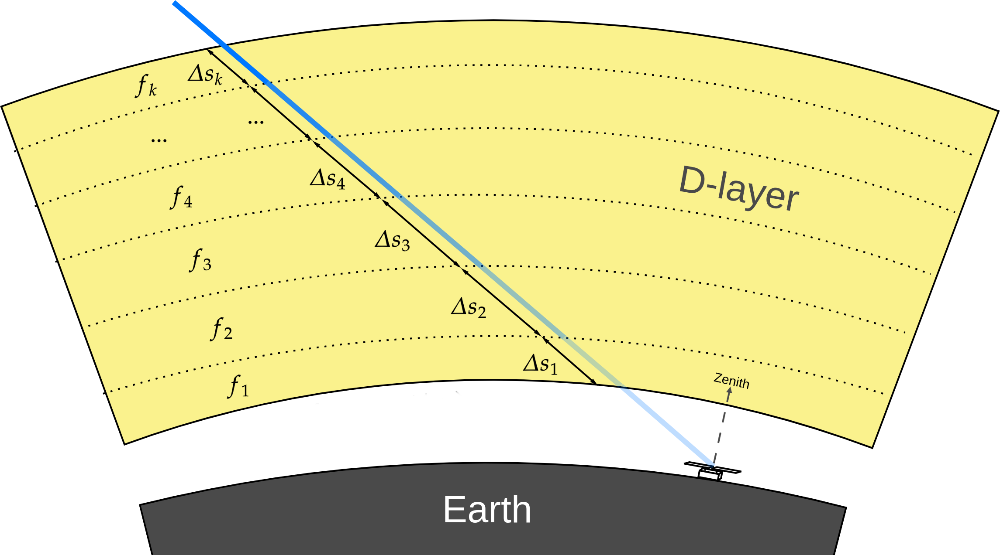

Overview
========

Theory background
-----------------
The ionosphere is a layer magnetized plasma in the atmosphere of Earth, which extents approximately from 50 km to 600 km
above the surface. Wave propagation through the ionosphere can be described by plasma physics laws, in particular by
Appleton–Hartree equation :cite:p:`Shkarofsky1961`. This equation relates a complex refractive index :math:`\eta` with
properties of ionospheric plasma (magnetic fields, electron density, etc.). Since behavior of magnetic fields in the
ionosphere is highly variable, it cannot be predicted without constant observations, which, in turn, makes it impossible
(for now) to create a general dynamic model of the ionosphere.
Fortunately, we can ignore the effect of the magnetic
fields for wide-field radio experiments :cite:p:`Vedantham2014`, which allows us to write the Appleton–Hartree equation
in simplified form:

.. math::

    \eta^2 = 1 - \frac{(\nu_p / \nu)^2}{1 - i(\nu_c / \nu)}

Here :math:`\nu` - frequency of observation, :math:`\nu_p` - plasma frequency, :math:`\nu_c` - electron collision
frequency.

    Two dominating ionosphere effects: attenuation in the D-layer and refraction in the F-layer.

We use collision model from :cite:t:`AGGARWAL1979753`

Attenuation in D-layer
----------------------

    Two dominating ionosphere effects: attenuation in the D-layer and refraction in the F-layer.

Refraction in F-layer
---------------------
.. figure:: images/Frefraction.png
    :scale: 30
    :align: center

    Two dominating ionosphere effects: attenuation/emission in the D-layer and refraction in the F-layer.

Frequency limits
----------------

.. figure:: images/lecutoff.png
    :scale: 50
    :align: center

    Two dominating ionosphere effects: attenuation in the D-layer and refraction in the F-layer.

References
----------
.. bibliography::

