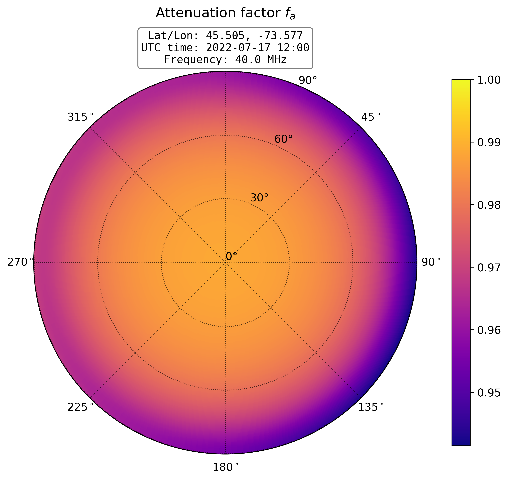
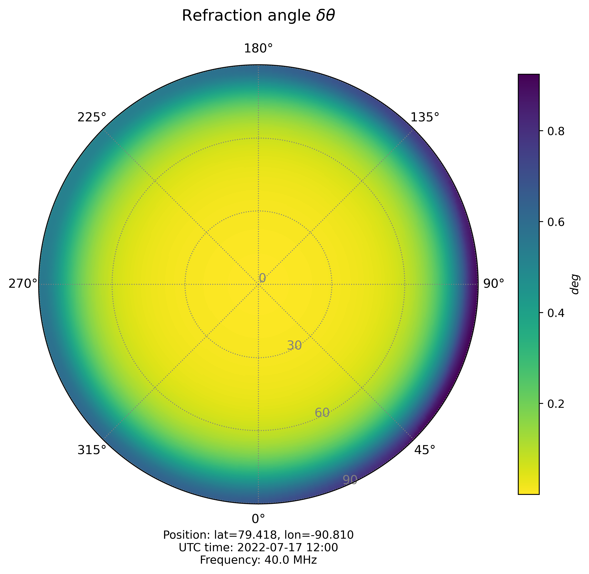

Quickstart
============

.. code-block::

    from dionpy import IonFrame
    import numpy as np
    import matplotlib.pyplot as plt
    from datetime import datetime

    # Date of observation
    dt = datetime(year=2022, month=7, day=17, hour=12, minute=0)

    # Instrument position: latitude [deg], longitude [deg], altitude [m]
    pos = (79.418, -90.810, 0)

    # Define a model
    model = IonFrame(dt, pos)

    # Define frequency of observation in [MHz]
    freq = 40

    # Plot ionospheric attenuation
    model.plot_atten(freq, title=r"Attenuation factor $f_a$")
    plt.show()

    # Plot ionospheric refraction
    model.plot_refr(freq, title=r"Refraction angle $\delta \theta$")
    plt.show()

.. code-block::

    # Define working coordinate grid
    el = np.linspace(0, 90, 100)  # Elevation axis
    az = np.linspace(0, 360, 100)  # Azimuth axis
    el_m, az_m = np.meshgrid(el, az)  # Rectangular coordinate grid

    # Access attenuation in numeric form
    atten = model.atten(el_m, az_m, freq)

    print(f"Attenuation at {freq} MHz\n" +
          f"Min:\t{np.min(atten):.2f}\n" +
          f"Max:\t{np.max(atten):.2f}\n")

    # Access refraction in numeric form
    refr = model.refr(el_m, az_m, freq)

    print(f"Refraction at {freq} MHz\n" +
          f"Min:\t{np.min(refr):.2f}\n" +
          f"Max:\t{np.max(refr):.2f}")

.. code-block::

    Attenuation at 40 MHz
    Min:    0.83
    Max:    0.98

    Refraction at 40 MHz
    Min:    0.00
    Max:    0.92

