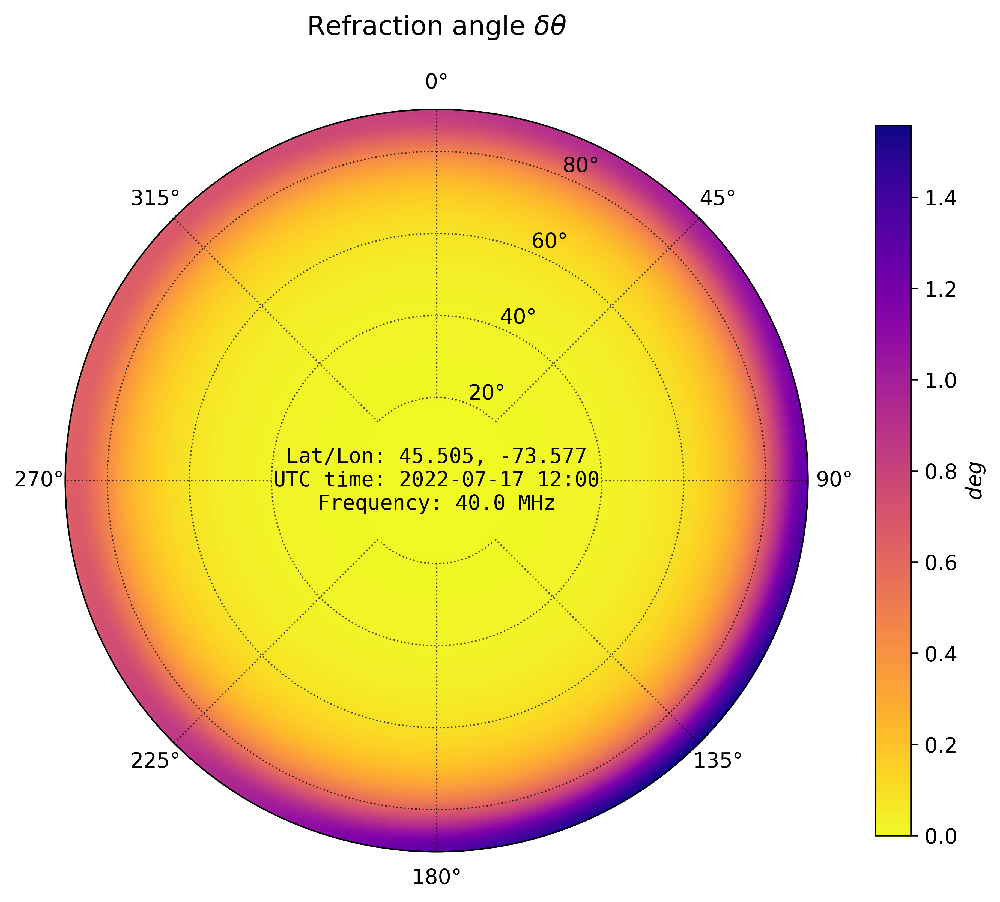

Quickstart
============

.. code-block::

    from dionpy import IonFrame
    import numpy as np
    import matplotlib.pyplot as plt
    from datetime import datetime

    # Date of observation
    dt = datetime(year=2022, month=7, day=17, hour=12, minute=0)

    # Instrument position: latitude [deg], longitude [deg], altitude [m]
    pos = (45.5048, -73.5772, 0)

    # Define a model; nlayers and nside are modified for illustration,
    # but it is better to use default parameters
    frame = IonFrame(dt, pos, nlayers=100, nside=32)

    # Define frequency of observation in [MHz]
    freq = 40

    # Plot ionospheric attenuation
    frame.plot_atten(freq, title=r"Attenuation factor $f_a$")
    plt.show()

    # Plot ionospheric refraction
    frame.plot_refr(freq, title=r"Refraction angle $\delta \theta$", cinfo=True)
    plt.show()

.. code-block::

    # Define working coordinate grid
    el = np.linspace(0, 90, 100)  # Elevation axis
    az = np.linspace(0, 360, 100)  # Azimuth axis
    el_m, az_m = np.meshgrid(el, az)  # Rectangular coordinate grid

    # Access attenuation and refraction in numeric form
    refr, atten, emiss = frame.raytrace(el_m, az_m, freq)

    print(f"Attenuation factor at {freq} MHz\n" +
          f"Min:\t{np.min(atten):.2f}\n" +
          f"Max:\t{np.max(atten):.2f}\n")

    print(f"Refraction at {freq} MHz\n" +
          f"Min:\t{np.min(refr):.2f}\n" +
          f"Max:\t{np.max(refr):.2f}")

.. code-block::

    Attenuation factor at 40 MHz
    Min:    0.94
    Max:    0.99

    Refraction at 40 MHz
    Min:    0.00
    Max:    1.56

