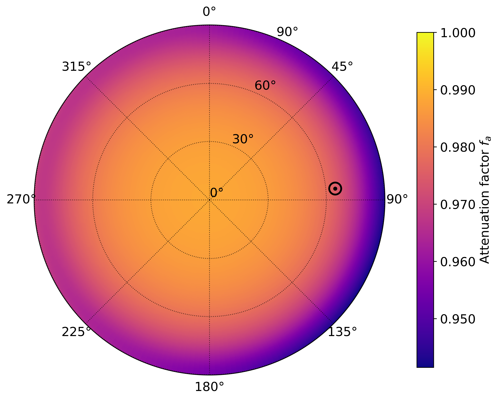

User Guide
==========

Introduction
------------
The :class:`~dionpy.IonFrame` class is the primary tool in the package. It represents the state of the ionosphere at a given
moment. :class:`~dionpy.IonFrame` contains information about the date, instrument position, calculated electron
density and electron temperature in the instrument's field of view. The :func:`~dionpy.IonFrame.raytrace` method
of the :class:`~dionpy.IonFrame`
uses precalculated electron density to calculate the wave propagation trajectories through the ionosphere. In the
process, it also calculates the integrated absorption and emission of the ionosphere.

.. _guide-ionframe:

Initializing IonFrame
---------------------
The :class:`~dionpy.IonFrame` requires only two positional parameters: time of observation and position of the
instrument (basically, the center point of the model). The time should be specified using standard
:class:`datetime.datetime` class. For example, let's say we observe on November 7, 2020, at 13:00. In Python, it will look
like:

.. code-block:: python

    from datetime import datetime

    dt = datetime(year=2020, month=11, day=7, hour=13)
    # or
    dt = datetime(2020, 11, 7, 13)

.. note::

    The time in :class:`~dionpy.IonFrame` must be specified in UTC.

The position of the instrument should be a tuple with three parameters: latitude in degrees, longitude in degrees,
elevation above sea level in meters, For example:

.. code-block:: python

    pos = (45.5048, -73.5772, 0)

After that, the model is initialized by simply passing these two parameters to :class:`~dionpy.IonFrame`:

.. code-block:: python

    from dionpy import IonFrame

    frame = IonFrame(dt, pos)
    print(frame)

.. note::

    The electron density and temperature will be calculated at the moment of :class:`~dionpy.IonFrame` initialization.
    If you want to defer calculation, set :code:`IonFrame(..., autocalc=False)` and later call :code:`IonFrame.calc()`
    to finish the calculation.

The printed output will be:

.. code-block:: text

    IonFrame instance
    Date:   07 Nov 2020 13:00:00 UTC
    Position:
            lat = 45.50 [deg]
            lon = -73.58 [deg]
            alt = 0.00 [m]
    NSIDE:  64
    IRI version:    2020
    Use E-CHAIM:    False
    Layer properties:
            Bottom height:  60 [km]
            Top height:     500 [km]
            N sublayers:    500

The output mentions some additional parameters we haven't touched yet. Let's discuss it now:

.. list-table:: Additional parameters of :class:`~dionpy.IonFrame`
   :widths: 20 85
   :header-rows: 1

   * - Parameter
     - Explanation
   * - :code:`nside`
     - The :code:`nside` parameter specifies the spacial resolution of the geographical
       grid. Must be a power of 2. Higher :code:`nside` means better resolution but
       also slower computation time and higher memory consumption. Default value is
       :code:`nside=64`, but :code:`nside=32` should be fine too in most cases.

   * - :code:`iriversion`
     - The :code:`iriversion` parameter specifies the version of the IRI model to use.
       Currently, available options are :code:`iriversion=20` (IRI-2020) and
       :code:`iriversion=16` (IRI-2016). Using the last version is recommended unless
       you have a solid reason not to.

   * - :code:`echaim`
     - Setting :code:`echaim=True` makes :class:`~dionpy.IonFrame` use E-CHAIM model
       for the electron density calculation instead of IRI. Note that E-CHAIM works
       only for latitudes >55, so the instrument must be located highly in the North
       for E-CHAIM to cover all of its field of view.

   * - :code:`hbot`, :code:`htop`
     - Parameters :code:`hbot` and :code:`htop` specify
       bottom and top limits for raytracing in kilometres, respectively.

   * - :code:`nlayers`
     - The :code:`nlayers` parameter specifies the number of surfaces at which the new
       refraction angle will be calculated. Default values :code:`nlayers=500` together
       with default :code:`hbot=60` and :code:`htop=500` correspond to ~0.9 km of
       vertical resolution. It is possible, however, to decrease the resolution without
       losing much accuracy. For example, :code:`nlayers=200` results in almost
       unnoticeable change but considerably decreases model calculation time.

So, the initialization of the customized :class:`~dionpy.IonFrame` can look something like this:

.. code-block:: python

    from dionpy import IonFrame
    from datetime import datetime

    dt = datetime(2020, 11, 7, 13)
    pos = (45.5048, -73.5772, 0)
    frame = IonFrame(dt, pos, nside=32, nlayers=200)

Raytracing within the frame
---------------------------
To perform the raytracing, one needs to specify two things: the ray's initial direction and the wave's frequency.
While the frequency is a single float number in MHz, the direction is determined by coordinates in the horizontal
coordinate system: altitude (also called elevation) and azimuth, both in degrees. Altitude and azimuth can be floats
and numpy arrays of any dimensions. The raytracing output shape will match the coordinate array shape in the latter
case. Consider the following example:

.. code-block:: python

    from dionpy import IonFrame
    from datetime import datetime
    import matplotlib.pyplot as plt

    # Frame calculation
    dt = datetime(2020, 11, 7, 13)
    pos = (45.5048, -73.5772, 0)
    frame = IonFrame(dt, pos, nside=32, nlayers=200)

    freq = 40  # Specified in MHz
    alt = np.linspace(0, 90, 100)
    az = np.zeros(alt.shape)    # The azimuth is 0 for all specified altitudes

    refr, atten, emiss = frame.raytrace(alt, az, freq)

    # Plotting attenuation as an example
    plt.plot(alt, (1 - atten) * 100, lw=2)
    plt.ylabel("Absorption in %")
    plt.xlabel("Altitude in [deg] above horizon")
    plt.show()

Visualizing frames
------------------
:class:`~dionpy.IonFrame` includes several pre-implemented methods to visualize the ionosphere's state and the
raytracing results. These inlude: :func:`~dionpy.IonFrame.plot_ed`, :func:`~dionpy.IonFrame.plot_et`,
:func:`~dionpy.IonFrame.plot_atten`, :func:`~dionpy.IonFrame.plot_refr`, :func:`~dionpy.IonFrame.plot_emiss` and
:func:`~dionpy.IonFrame.plot_troprefr` (click on the name for more info). While these methods plot different data, they
all share a set of parameters listed below.

.. list-table:: Additional parameters of plotting methods
   :widths: 15 85
   :header-rows: 1

   * - Parameter
     - Explanation
   * - :code:`title`
     - Title of the plot.
   * - :code:`barlabel`
     - Text label next to the colorbar. Most implemented methods override this parameter. Set
       :code:`barlabel=None` for no label.
   * - :code:`plotlabel`
     - Bool indicating whether to include an additional text label. This label usually includes frame info -
       date/time, location and frequency of an observation. If set to None - no label is added.
   * - :code:`cblim`
     - A tuple containing custom bottom and top limits for the colorbar.
   * - :code:`saveto`
     - A path to save the plotted figure. Must also include the name of the file. If not specified - the figure
       will not be saved.
   * - :code:`dpi`
     - Image resolution (when saving).
   * - :code:`cmap`
     - A colormap to use. Can be a custom colormap or a string specifying existing matplotlib colormap.
   * - :code:`cbformat`
     - Formatter of numbers on the colorbar scale.
   * - :code:`nancolor`
     - A color to fill np.nan in the plot (default - black).
   * - :code:`infcolor`
     - A color to fill np.inf in the plot (default - white).
   * - :code:`local_time`
     - Integer representing the difference between local time and UTC. If specified - local time is shown instead of UTC.
   * - :code:`cinfo`
     - If True - places the :code:`plotlabel` info in the centre of the picture.
   * - :code:`lfont`
     - If True - the font size of labels is increased.
   * - :code:`cbar`
     - If False - the colorbar is removed from the plot.
   * - :code:`sunpos`
     - If True - the position of the sun is plotted on top. Dashed line if the Sun is below horizon.

Here are some examples.

.. code-block:: python

    from dionpy import IonFrame
    from datetime import datetime
    import matplotlib.pyplot as plt

    dt = datetime(year=2022, month=7, day=17, hour=12, minute=0)
    pos = (45.5048, -73.5772, 0)
    frame = IonFrame(dt, pos, nlayers=200, nside=32)
    freq = 40
    frame.plot_atten(freq,
                     barlabel=r"Attenuation factor $f_a$",
                     cbformat="{x:.3f}",
                     plotlabel=None,
                     sunpos=True,
                     lfont=True)
    plt.show()

In the picture above, the circle with the dot indicates the position of the sun in the sky (solid contour means above
horizon; dashed - below horizon).

Using the same frame, let's now plot refraction.

.. code-block:: python

    frame.plot_refr(freq,
                    cinfo=True,
                    cmap="viridis_r",
                    local_time=-5)
    plt.show()

Introducing IonModel
--------------------
If you want to perform a continuous modelling of the ionosphere, generating an IonFrame for each time step
might be an overkill. On a small time scale (about several minutes) a linear interpolation between two IonFrames
gives a good approximation of the temporal evolution of the ionosphere. This interpolation is already implemented
within the :class:`~dionpy.IonModel` class. :class:`~dionpy.IonModel` is a collection of successive IonFrames
uniformly distributed in time. By using linear interpolation, one can calculate an IonFrame for any time within
the model range.

The initialization of :class:`~dionpy.IonModel` is similar to :class:`~dionpy.IonFrame`, except two time stamps
are required, which represent the start and the end times. Additional parameter - :code:`mpf` (minutes per frame) -
controls the temporal resolution of the :class:`~dionpy.IonModel`. For example, :code:`mpf=15` means that a new
:class:`~dionpy.IonFrame` will be generated every 15 minutes.

The interpolation is done using the :func:`~dionpy.IonModel.at` method, which accepts a datetime object and returns
an :class:`~dionpy.IonFrame` at the specified time. Here is an example.

.. code-block:: python

    from dionpy import IonModel
    from datetime import datetime
    import matplotlib.pyplot as plt

    dt_start = datetime(year=2022, month=7, day=17, hour=6, minute=0)
    dt_end = datetime(year=2022, month=7, day=17, hour=7, minute=0)
    dt_middle = datetime(year=2022, month=7, day=17, hour=6, minute=35)
    pos = (45.5048, -73.5772, 0)

    model = IonModel(dt_start, dt_end, pos, mpf=10, nlayers=200, nside=32)
    frame = model.at(dt_middle)

    freq = 40
    frame.plot_atten(freq)
    plt.show()

The output will be:

.. code-block:: text

    Calculating time frames: 100%|██████████████████████████████████| 7/7 [00:09<00:00,  1.29s/it]

Saving frames and models
------------------------
Calculating frames can take significant time, especially for greater-resolution grids. It takes even
more time for IonModels. In the last section's example, the model calculation took 9 seconds. But
for longer models (say, several hours or days) it would be better to save the calculated model to
the disk and load it later. In :code:`dionpy`, it is done with :func:`~dionpy.IonFrame.save` and :func:`~dionpy.IonFrame.load` methods.
These methods work both for :class:`~dionpy.IonFrame` and :func:`~dionpy.IonModel.`

The :func:`~dionpy.IonFrame.save` method saves the whole model to the `HDF <https://www.hdfgroup.org/solutions/hdf5/>`_ file. It
requires specification of the path, including the name of the file. For example:

.. code-block:: python

    frame.save("frames/my_frame")
    # or
    model.save("models/my_model.h5")
    # (specification of file extension is not necessary)

To load the saved model, use the :func:`~dionpy.IonFrame.load` class method of the appropriate class. For instance,
to load an IonFrame use

.. code-block:: python

    from dionpy import IonFrame
    frame = IonFrame.load("frames/my_frame")

and for loading an IonModel use

.. code-block:: python

    from dionpy import IonModel
    frame = IonModel.load("models/my_model")

Animating models
----------------
The :class:`~dionpy.IonModel` also includes the :func:`~dionpy.IonModel.animate` method, which allows the creation of animated
videos of the temporal evolution of specified parameters. The main parameters of the :func:`~dionpy.IonModel.animate`
are:

.. list-table:: Controlling parameters of :code:`IonModel.animate()`
   :widths: 15 85
   :header-rows: 1

   * - Parameter
     - Explanation
   * - :code:`saveto`
     - Location of the output files. Defaults to the script execution directory ("./").
   * - :code:`fps`
     - Frames per second.
   * - :code:`duration`
     - Total duration of the video in seconds.

For example, let's generate videos of attenuation and refraction for a period of one day. We will set
the total duration to 10 seconds and fps to 20 frames/sec.

.. code-block:: python

    from dionpy import IonModel
    from datetime import datetime

    dt_start = datetime(year=2022, month=7, day=17)
    dt_end = datetime(year=2022, month=7, day=18)
    pos = (45.5048, -73.5772, 0)

    model = IonModel(dt_start, dt_end, pos, mpf=30, nlayers=200, nside=32)

    freq = 40
    model.animate(freq=freq, target=["atten", "refr"], fps=20, duration=5, cinfo=True)

The output will be:

.. code-block:: text

    Calculating time frames: 100%|█████████████████████████████| 49/49 [01:03<00:00,  1.30s/it]
    Animation making procedure started
    Calculating data
    Raytracing frames: 100%|███████████████████████████████████| 101/101 [00:35<00:00,  2.83it/s]
    Rendering atten frames: 100%|██████████████████████████████| 101/101 [00:35<00:00,  2.84it/s]
    Rendering atten animation: 100%|███████████████████████████| 100/100 [00:03<00:00, 33.24it/s]
    Rendering refr frames: 100%|███████████████████████████████| 101/101 [00:33<00:00,  3.06it/s]
    Rendering refr animation: 100%|████████████████████████████| 100/100 [00:02<00:00, 46.60it/s]

The generated attenuation video:

.. video:: _static/atten.mp4 _static/atten.webm
    :autoplay:
    :loop:
    :nocontrols:
    :width: 500

The generated refraction video:

.. video:: _static/refr.mp4 _static/refr.webm
    :autoplay:
    :loop:
    :nocontrols:
    :width: 500

